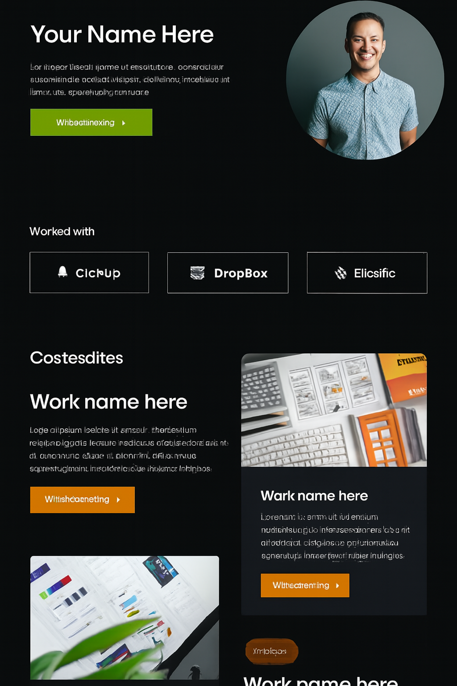

# 🌐 Personal Portfolio Website

A modern, fully responsive **Portfolio Website Template** built with HTML, CSS, and JavaScript.  
This project is designed to showcase personal projects, skills, and achievements in a clean and professional way.

---

## 🚀 Tech Stack

- ⚙️ **HTML5** – Semantic and accessible structure  
- 🎨 **CSS3** – Styling, responsive design, and animations  
- 🧠 **JavaScript (ES6+)** – Interactive elements and DOM manipulation  
- 🧩 **Font Awesome 6.5.2** – Iconography for visual clarity

---

## ✨ Features

- 📌 **Sticky Navigation Bar** – Always visible for smooth browsing  
- 🎨 **Modern UI/UX** – Gradient backgrounds, hover effects, and animations  
- ⚡ **Scroll Animations** – Elements appear dynamically while scrolling  
- 🖼️ **Case Studies & Projects Section** – Showcase of previous work  
- 💬 **Testimonials Section** – Client feedback and reviews  
- 📧 **Contact Form** – Simple form for user interaction

---

## 📸 Preview

Here’s a visual overview of the layout:

🔗 Live Demo

Check out the live website here: [▶ View Demo](https://muradisazade777.github.io/Simple-animated-Portfolio/)
---

## 📂 Folder Structure

portfolio-website/
├── index.html
├── css/
│   └── style.css
├── js/
│   └── script.js
├── assets/
│   └── images/
│       └── portfolio-preview.png
└── README.md
Designed & developed with ❤️ by Murad
